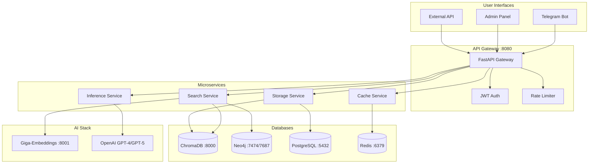
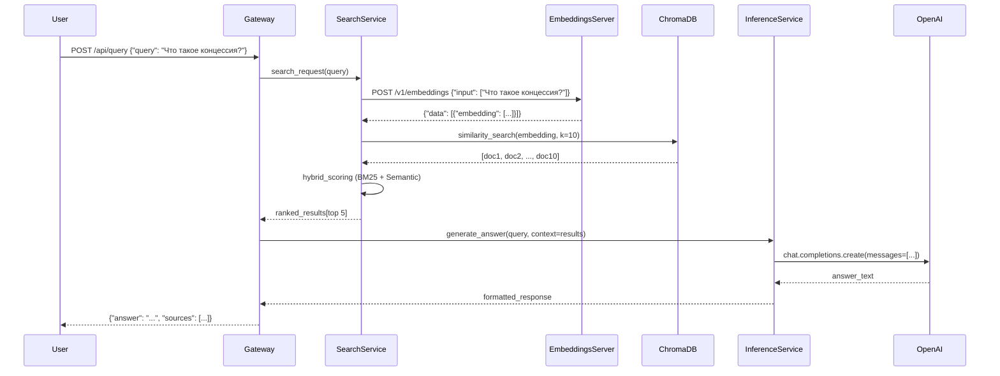

# Обзор архитектуры

LegalRAG — это production-ready микросервисная AI система для анализа российских правовых документов.

---

## Высокоуровневая архитектура



---

## Ключевые компоненты

### 🎭 Microservices Layer

5 независимых сервисов, каждый наследуется от `BaseService`:

#### 1. API Gateway (port 8080)

**Роль**: Центральная точка входа для всех запросов

**Функции**:
- Request routing с service registry
- JWT authentication для admin panel
- Rate limiting (100 requests/60s per IP)
- CORS middleware для веб-клиентов

**Endpoints**:
```
POST /api/query                 # Стандартный поиск
POST /api/hybrid_search         # Гибридный поиск
POST /api/universal_legal_query # Расширенный legal запрос
GET  /health/all                # Health check всех сервисов
```

**Файлы**:
- [services/gateway/routes/queries.py](../../services/gateway/routes/queries.py)
- [services/gateway/middleware.py](../../services/gateway/middleware.py)

---

#### 2. Search Service

**Роль**: Выполнение поисковых запросов (Hybrid BM25 + Graph RAG)

**Функции**:
- **Hybrid BM25 Search** (60% BM25 + 40% Semantic)
- Graph-enhanced search через Neo4j
- Query preprocessing и tokenization
- Result ranking и scoring

**Алгоритмы**:
```python
# Hybrid scoring
hybrid_score = 0.6 * bm25_score + 0.4 * semantic_score

# Legal tokenization
tokens = LegalTokenizer.tokenize(query)
# Сохраняет многословные термины: "концессионное соглашение"
```

**Файлы**:
- [services/search_service_core.py](../../services/search_service_core.py)
- [services/search_factory.py](../../services/search_factory.py)
- [core/hybrid_bm25_search.py](../../core/hybrid_bm25_search.py)
- [core/graph_enhanced_search.py](../../core/graph_enhanced_search.py)

---

#### 3. Inference Service

**Роль**: Генерация ответов через AI модели (OpenAI GPT-4/GPT-5)

**Функции**:
- Answer generation с промптами
- API key rotation для высокого throughput
- Prompt template management
- Response formatting и validation

**Models** (после миграции v2.0):
- **GPT-4 Turbo**: Primary для reasoning и ответов
- **GPT-3.5 Turbo**: Fallback для простых задач

**Файлы**:
- [services/inference_service.py](../../services/inference_service.py)
- [core/ai_inference_core.py](../../core/ai_inference_core.py)
- [core/openai_inference_client.py](../../core/openai_inference_client.py)

---

#### 4. Storage Service

**Роль**: Унифицированный доступ к данным (PostgreSQL, Redis, ChromaDB)

**Функции**:
- Document upload и processing
- User permission management
- Metadata и chunk retrieval
- Database connection pooling

**Databases**:
- **PostgreSQL**: User data, document metadata, processing status
- **ChromaDB**: Vector embeddings (1024-dim после миграции)
- **Redis**: Sessions, temporary data

**Файлы**:
- [services/storage_service.py](../../services/storage_service.py)
- [core/data_storage_suite.py](../../core/data_storage_suite.py)
- [core/postgres_manager.py](../../core/postgres_manager.py)

---

#### 5. Cache Service

**Роль**: Интеллектуальное кэширование для ускорения повторных запросов

**Функции**:
- Multi-level caching (Memory + Redis)
- Semantic similarity matching (75% threshold)
- TTL-based cache invalidation
- Cache hit rate: **67%** на похожих запросах

**Strategies**:
```python
# Adaptive caching (default)
cache_strategy = "adaptive"
cache_ttl = 3600  # 1 hour

# Aggressive caching (for production)
cache_strategy = "aggressive"
cache_ttl = 7200  # 2 hours
```

**Файлы**:
- [services/cache_service.py](../../services/cache_service.py)
- [core/redis_manager.py](../../core/redis_manager.py)

---

### 🤖 AI Stack

#### Giga-Embeddings Server (port 8001)

**Роль**: Локальная генерация векторных embeddings

**Характеристики**:
- **Модель**: `ai-forever/sbert_large_nlu_ru` (sentence-transformers)
- **Dimension**: 1024-dim vectors
- **Latency**: 0.5-1 сек на запрос (3-6x быстрее Gemini API)
- **Throughput**: Нет rate limits
- **Memory**: 6GB RAM

**API** (OpenAI-compatible):
```bash
POST /v1/embeddings
{
  "input": ["текст 1", "текст 2"],
  "model": "giga-embeddings-instruct"
}
```

**Deployment**:
```yaml
# docker-compose.embeddings.yml
services:
  legalrag_embeddings:
    build: ./services/embeddings
    ports:
      - "8001:8001"
    deploy:
      resources:
        limits:
          memory: 6G
          cpus: '4'
```

**Файлы**:
- [services/embeddings/embeddings_server.py](../../services/embeddings/embeddings_server.py)
- [services/embeddings/Dockerfile](../../services/embeddings/Dockerfile)
- [core/giga_local_embeddings_client.py](../../core/giga_local_embeddings_client.py)

---

#### OpenAI GPT-4/GPT-5

**Роль**: Language Model для reasoning и генерации ответов

**Использование**:
- **Extraction**: `gpt-4-turbo` (извлечение текста из документов)
- **Reasoning**: `gpt-4-turbo` (анализ юридических запросов)
- **Classification**: `gpt-4-turbo` (классификация документов)

**Configuration**:
```python
# core/openai_inference_client.py
ChatOpenAI(
    model="gpt-4-turbo",
    openai_api_key=api_key,
    temperature=0.1,      # Детерминированные ответы
    max_tokens=2048,      # Развернутые ответы
    max_retries=3         # Retry на network errors
)
```

**Файлы**:
- [core/openai_inference_client.py](../../core/openai_inference_client.py)
- [core/api_key_manager.py](../../core/api_key_manager.py)

---

### 💾 Database Layer

#### ChromaDB (port 8000)

**Роль**: Vector database для семантического поиска

**Характеристики**:
- **Vectors**: 1024-dim (после миграции v2.0)
- **Documents**: ~250+ chunks (115-FZ + 224-FZ)
- **Metadata**: law_number, article_number, document_type
- **API**: HTTP REST API (async)

**Schema**:
```python
{
    "id": "uuid",
    "text": "содержание статьи...",
    "embedding": [0.123, ...],  # 1024-dim
    "metadata": {
        "law_number": "115-FZ",
        "article_number": "10.1",
        "document_type": "federal_law"
    }
}
```

**Файлы**:
- [core/vector_store_manager.py](../../core/vector_store_manager.py)

---

#### Neo4j (ports 7474/7687)

**Роль**: Graph database для связей между статьями и определениями

**Данные**:
- **156 articles** (nodes)
- **95 definitions** (nodes)
- **1,794 relationships** (CONTAINS, REFERENCES, RELATED_TO)

**Graph Schema**:
```
(Article)-[:CONTAINS]->(Definition)
(Article)-[:REFERENCES]->(Article)
(Article)-[:RELATED_TO]->(Article)
```

**Запрос определений**:
```cypher
MATCH (d:Definition)
WHERE d.full_term = "концессионное соглашение"
RETURN d.definition, d.law, d.article
```

**Файлы**:
- [scripts/extract_definitions_to_neo4j.py](../../scripts/extract_definitions_to_neo4j.py)
- [tools/graph_tools.py](../../tools/graph_tools.py)

---

#### PostgreSQL (port 5432)

**Роль**: Relational database для структурированных данных

**Таблицы**:
```sql
-- User management
CREATE TABLE users (
    id SERIAL PRIMARY KEY,
    telegram_id BIGINT UNIQUE,
    permissions JSONB,
    created_at TIMESTAMP
);

-- Document metadata
CREATE TABLE documents (
    id UUID PRIMARY KEY,
    filename TEXT,
    law_number TEXT,
    processing_status TEXT,
    uploaded_at TIMESTAMP
);
```

**Файлы**:
- [core/postgres_manager.py](../../core/postgres_manager.py)

---

#### Redis (port 6379)

**Роль**: In-memory cache и session storage

**Use Cases**:
- Query result caching (TTL: 1-2 hours)
- User sessions (TTL: 8 hours for admin panel)
- Background task queue
- Rate limiting counters

**Файлы**:
- [core/redis_manager.py](../../core/redis_manager.py)

---

## Request Flow

### Типичный запрос пользователя



**Время выполнения**:
- Embeddings: ~0.5-1 сек
- ChromaDB search: ~0.2 сек
- BM25 scoring: ~0.1 сек
- GPT-4 generation: ~3-5 сек
- **Total**: ~5-8 сек

---

## Паттерны и best practices

### BaseService Pattern

Все микросервисы наследуются от базового класса:

```python
# services/base.py
class BaseService:
    async def initialize(self) -> bool:
        """Инициализация сервиса"""

    async def health_check(self) -> dict:
        """Health check endpoint"""

    async def shutdown(self):
        """Graceful shutdown"""
```

**Преимущества**:
- Унифицированный lifecycle management
- Встроенные health checks
- Graceful shutdown с cleanup
- Metrics collection

---

### Unified Storage Pattern

Единая точка доступа ко всем базам данных:

```python
from core.data_storage_suite import UnifiedStorageManager

storage = UnifiedStorageManager()
await storage.initialize()

# PostgreSQL
user = await storage.get_user(telegram_id)

# Redis
await storage.cache_result(query, result, ttl=3600)

# ChromaDB
results = await storage.search_documents(query, k=5)
```

---

### API Key Rotation Pattern

Автоматическая ротация для обхода rate limits:

```python
from core.api_key_manager import get_key_manager

key_manager = get_key_manager(provider="openai")

# Round-robin
key1 = key_manager.get_next_key()
key2 = key_manager.get_next_key()

# Load balancing
balanced_key = key_manager.get_key_with_least_usage()
```

---

## Scalability

### Horizontal Scaling

**Микросервисы** могут масштабироваться независимо:

```bash
# Scale Search Service to 3 instances
docker-compose up -d --scale search_service=3

# Scale Inference Service to 2 instances
docker-compose up -d --scale inference_service=2
```

**Load Balancer** (опционально):
```yaml
# docker-compose.yml
services:
  nginx:
    image: nginx:alpine
    ports:
      - "80:80"
    volumes:
      - ./nginx.conf:/etc/nginx/nginx.conf
    depends_on:
      - search_service
```

---

### Vertical Scaling

**Embeddings Server** resource tuning:

```yaml
# docker-compose.embeddings.yml
deploy:
  resources:
    limits:
      memory: 8G      # Увеличить с 6G
      cpus: '6'       # Увеличить с 4
```

**PostgreSQL** connection pool:
```bash
# .env
POSTGRES_MAX_POOL_SIZE=50  # Увеличить с 20
```

---

## Мониторинг

### Health Checks

```bash
# Проверка всех сервисов
curl http://localhost:8080/health/all
```

**Ожидаемый ответ**:
```json
{
  "status": "healthy",
  "services": {
    "gateway": "up",
    "search": "up",
    "inference": "up",
    "storage": "up",
    "cache": "up"
  },
  "databases": {
    "postgres": "connected",
    "redis": "connected",
    "chromadb": "connected",
    "neo4j": "connected"
  }
}
```

---

### Metrics Collection

**Встроенные метрики**:
- Request latency (p50, p95, p99)
- Throughput (requests/second)
- Error rate (%)
- Cache hit rate (%)
- Database connection pool usage

**Экспорт** (опционально):
- Prometheus metrics endpoint: `/metrics`
- Grafana dashboards
- Structured logging (JSON format)

---

## Что дальше?

- 📖 [Microservices Details](microservices.md) - Детали каждого сервиса
- 💾 [Databases](databases.md) - Схемы баз данных
- 🔀 [RAG Workflow](rag-workflow.md) - LangGraph workflow
- 🔧 [API Reference](../api/search.md) - API документация
