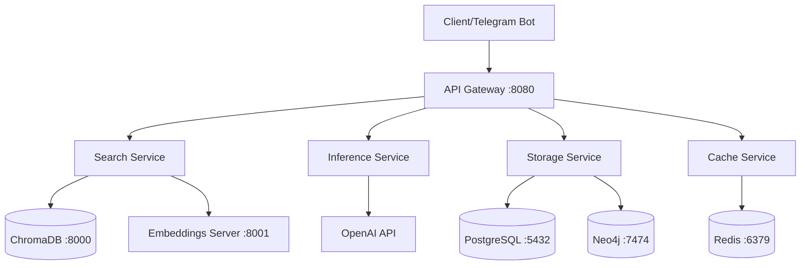

# LegalRAG Documentation

<div align="center">
  <h1>🏛️ LegalRAG</h1>
  <p><strong>AI система для анализа российских юридических документов</strong></p>
  <p>
    <a href="https://github.com/DinoZawrik/Gov_wiki"></a>
    <a href="#"></a>
    <a href="#"></a>
  </p>
</div>

---

## 🎯 Что такое LegalRAG?

**LegalRAG** - production-ready микросервисная AI система для анализа российских юридических документов.

Система объединяет:

- **🔍 Hybrid BM25+Semantic Search** (60%/40% вес) для поиска документов
- **🕸️ Neo4j Graph RAG** с 95 извлеченными определениями
- **🤖 LangGraph Agentic Workflows** с оценкой уверенности и автоматическим fallback
- **⚡ 3-уровневая цепочка fallback**: Vector DB → Neo4j Graph → Web Search

---

## 📊 Производительность

!!! success "Последние результаты (Октябрь 2025)"
    **39/40 (97.5%)** на комплексном тесте из 40 вопросов (~22 минуты)

---

## 🚀 Быстрый старт

### Требования

- Python 3.11+
- Docker & Docker Compose
- OpenAI API Key
- 26GB RAM (рекомендуется для VPS)

### Установка за 3 команды

```bash
# 1. Клонировать репозиторий
git clone https://github.com/DinoZawrik/Gov_wiki.git
cd Gov_wiki

# 2. Настроить окружение
cp .env.example .env
# Отредактировать .env: добавить OPENAI_API_KEY

# 3. Запустить систему
docker-compose up -d
docker-compose -f docker-compose.embeddings.yml up -d
python start_microservices.py
```

Подробнее: [Руководство по установке](guides/installation.md)

---

## 🆕 Миграция v2.0 (13.10.2025)

!!! warning "Миграция в процессе"
    Переход на **OpenAI GPT-4/GPT-5** + **Локальный Giga-Embeddings**

### Что изменилось

| Компонент | До (v1.0) | После (v2.0) |
|-----------|-----------|--------------|
| **LLM** | Gemini 2.5 Flash | OpenAI GPT-4 Turbo |
| **Embeddings** | External Gemini API | Local HTTP server (port 8001) |
| **Размерность** | 768-dim | 1024-dim |
| **Скорость** | ~0.3s/text | ~0.05-0.1s/text (3-6x faster) |
| **Rate Limits** | 250 RPD → 1500 RPD (ротация) | No limits для embeddings |

### Быстрый старт миграции

```bash
# 1. Проверка готовности
python check_migration_readiness.py

# 2. Запуск Giga-Embeddings сервера
docker-compose -f docker-compose.embeddings.yml up -d

# 3. Тест и миграция
python test_embeddings_server.py
```

Подробнее: [Руководство по миграции](migration/quickstart.md)

---

## 🏗️ Архитектура

### Микросервисы (5 компонентов)



### Базы данных (4 системы)

1. **ChromaDB** - векторная БД для чанков документов (1024-dim embeddings)
2. **Neo4j** - граф БД для определений и связей между статьями
3. **PostgreSQL** - управление пользователями, метаданные документов
4. **Redis** - кеширование, сессии, очереди задач

Подробнее: [Обзор архитектуры](architecture/overview.md)

---

## 📚 Основные возможности

### 🔍 Hybrid Search

Комбинация BM25 (keyword) и Semantic (embeddings) поиска:

```python
from core.hybrid_bm25_search import hybrid_search

results = await hybrid_search(
    chromadb_collection=collection,
    query="Что такое концессионное соглашение?",
    k=5,
    bm25_weight=0.6,      # 60% keyword matching
    semantic_weight=0.4   # 40% semantic similarity
)
```

### 🤖 LangGraph RAG Workflow

5-узловой state graph с multi-source fallback:

```python
from core.langgraph_rag_workflow import LangGraphRAGWorkflow

workflow = LangGraphRAGWorkflow()
result = await workflow.run(query="Что такое плата концедента?")
```

Узлы:

1. `retrieve_initial` - параллельный hybrid search + graph lookup
2. `grade_documents` - LLM оценка качества документов
3. `repair_retrieve` - переформулировка запроса + web search
4. `generate_answer` - генерация ответа через GPT-4
5. `critique_answer` - self-check с возможностью retry

### 📊 API Endpoints

```bash
# Стандартный поиск (Hybrid BM25 по умолчанию)
POST /api/query
{
  "query": "Что такое плата концедента?",
  "max_results": 5
}

# Health check
GET /health/all
```

Подробнее: [API Reference](api/search.md)

---

## 🛠️ Технологический стек

### AI & ML

- **openai** (v1.0+) - OpenAI GPT-4/GPT-5 inference
- **langchain-openai** - LangChain integration
- **sentence-transformers** - Giga-Embeddings модель
- **LangGraph** - Agentic workflow orchestration

### Frameworks

- **FastAPI** (v0.115+) - Modern async web framework
- **Aiogram** (v3.0+) - Telegram bot framework
- **Streamlit** - Admin panel

### Databases

- **ChromaDB** (v0.5+) - Vector database
- **Neo4j** - Graph database
- **PostgreSQL 16+** - Relational database
- **Redis 7+** - Cache & queue

### Search

- **rank-bm25** (v0.2+) - BM25 algorithm

---

## 📖 Документация

### Для начинающих

- [Быстрый старт](guides/quickstart.md) - установка за 5 минут
- [Конфигурация](guides/configuration.md) - настройка .env
- [Загрузка документов](guides/loading-data.md) - как добавить свои документы

### Миграция v2.0

- [Обзор миграции](migration/overview.md) - что изменилось
- [Быстрый старт миграции](migration/quickstart.md) - 5 шагов
- [Полный план](migration/full-plan.md) - детальная инструкция
- [Troubleshooting](migration/troubleshooting.md) - решение проблем

### Архитектура

- [Обзор системы](architecture/overview.md) - high-level architecture
- [Микросервисы](architecture/microservices.md) - 5 сервисов
- [RAG Workflow](architecture/rag-workflow.md) - LangGraph workflow

### API Reference

- [Embeddings Server](api/embeddings-server.md) - локальный HTTP API
- [OpenAI Client](api/openai-client.md) - GPT-4 integration
- [Vector Store](api/vector-store.md) - ChromaDB управление
- [Search API](api/search.md) - endpoints для поиска

---

## 🤝 Участие в разработке

Мы приветствуем contributions! См. [Contribution Guide](development/contributing.md)

---

## 📄 Лицензия

Этот проект разработан как портфолио-проект.

---

## 🔗 Полезные ссылки

- [GitHub Repository](https://github.com/DinoZawrik/Gov_wiki)
- [OpenAI API Docs](https://platform.openai.com/docs/)
- [FastAPI Documentation](https://fastapi.tiangolo.com/)
- [LangChain Documentation](https://python.langchain.com/)

---

<div align="center">
  <p>Сделано с ❤️ командой LegalRAG</p>
</div>
