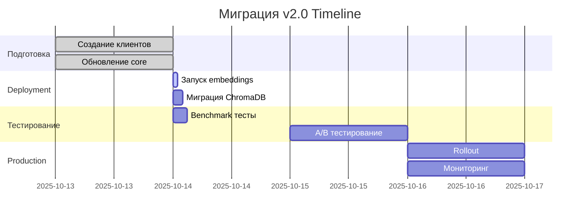

# Обзор миграции v2.0

Переход с Google Gemini на OpenAI GPT-4/GPT-5 + Локальный Giga-Embeddings сервер.

---

## Зачем мигрировать?

### Проблемы текущей системы (Gemini)

❌ **Rate Limits**: 250 RPD (requests per day) на бесплатном тарифе
❌ **Медленные embeddings**: 2-4 секунды на запрос из-за сетевых задержек
❌ **Качество embeddings**: 768-dim vectors недостаточны для русских юридических текстов
❌ **API нестабильность**: Периодические 429 ошибки даже с ротацией ключей
❌ **Зависимость от внешнего API**: Риск изменения условий использования

### Преимущества новой системы

✅ **GPT-4/GPT-5**: Значительно лучшее качество reasoning для юридических документов
✅ **Локальный Giga-Embeddings**: 1024-dim vectors, оптимизированные для русского языка
✅ **Без rate limits**: Embeddings генерируются локально без ограничений
✅ **3-6x быстрее**: Embeddings за 0.5-1 секунду (без сетевых задержек)
✅ **Полный контроль**: Embeddings сервер на том же VPS
✅ **Масштабируемость**: Легко добавить больше ресурсов на VPS

---

## Что изменится?

### AI Stack

| Компонент | До (v1.x) | После (v2.0) |
|-----------|-----------|--------------|
| **LLM** | Google Gemini 2.5 Flash | OpenAI GPT-4 Turbo / GPT-5 |
| **Embeddings** | Google Gemini API | Локальный Giga-Embeddings сервер |
| **Dimension** | 768-dim | 1024-dim |
| **Rate Limits** | 250 RPD (с ротацией: 1500 RPD) | Нет для embeddings, OpenAI limits для LLM |
| **Latency** | 2-4 сек/запрос | 0.5-1 сек/запрос |
| **LangChain** | langchain-google-genai | langchain-openai |

### Архитектура

**До миграции**:
```
User Query
    ↓
API Gateway
    ↓
Search Service → Google Gemini API (embeddings)
    ↓
ChromaDB (768-dim vectors)
    ↓
Inference Service → Google Gemini API (LLM)
    ↓
Response
```

**После миграции**:
```
User Query
    ↓
API Gateway
    ↓
Search Service → Local Giga-Embeddings Server (port 8001)
    ↓
ChromaDB (1024-dim vectors)
    ↓
Inference Service → OpenAI API (GPT-4/GPT-5)
    ↓
Response
```

---

## Что НЕ изменится?

✅ **Микросервисная архитектура**: 5 сервисов (Gateway, Search, Inference, Storage, Cache)
✅ **Hybrid BM25 Search**: 60/40 BM25+Semantic остается
✅ **Neo4j Graph RAG**: 95 definitions + 1794 relationships
✅ **LangGraph Workflow**: 5-node state graph с fallback chain
✅ **Базы данных**: PostgreSQL, Redis, ChromaDB, Neo4j
✅ **Telegram Bot**: Без изменений
✅ **Admin Panel**: Без изменений
✅ **API endpoints**: Полная обратная совместимость

---

## Этапы миграции

### 📋 Фаза 1: Подготовка (1-2 дня)

- [x] Создать HTTP клиенты (OpenAI + Giga-Embeddings)
- [x] Обновить core модули (vector_store_manager, ai_inference_core)
- [x] Обновить LangGraph workflow
- [x] Создать Dockerfile для embeddings сервера
- [x] Создать docker-compose.embeddings.yml
- [x] Обновить .env.example
- [x] Написать migration scripts

**Статус**: ✅ Завершена (13.10.2025)

### 🚀 Фаза 2: Deployment (30-60 минут)

1. Запустить Giga-Embeddings сервер
2. Проверить размерность векторов
3. Мигрировать ChromaDB (если нужно)
4. Обновить зависимости
5. Запустить систему

**Статус**: ⏳ Готова к выполнению

### ✅ Фаза 3: Тестирование (2-3 часа)

- [ ] Запустить 40-question benchmark
- [ ] Проверить performance metrics
- [ ] Сравнить качество ответов
- [ ] Тестировать под нагрузкой

**Целевые метрики**:
- Accuracy: ≥97% (текущий: 97.5% на Gemini)
- Latency: ≤30 сек/запрос (текущий: 32.9 сек)
- Throughput: ≥100 запросов/час

### 🔍 Фаза 4: Валидация (1 день)

- [ ] A/B тестирование на реальных запросах
- [ ] Мониторинг ошибок
- [ ] Проверка memory usage
- [ ] Проверка disk usage

### 🎯 Фаза 5: Production Rollout (1 день)

- [ ] Обновить production .env
- [ ] Перезапустить все сервисы
- [ ] Мониторинг 24 часа
- [ ] Документировать известные issues

### 🗑️ Фаза 6: Cleanup (опционально)

- [ ] Удалить legacy Gemini код (если все стабильно)
- [ ] Удалить старые API keys
- [ ] Обновить документацию

---

## Требования к системе

### Минимальные

- **CPU**: 6 cores (текущий VPS)
- **RAM**: 26GB (текущий VPS) - достаточно
- **Disk**: 80GB SSD (текущий VPS) - достаточно
- **Network**: 100 Mbps

### Рекомендуемые для production

- **CPU**: 8+ cores
- **RAM**: 32GB+
- **Disk**: 100GB+ SSD
- **Network**: 1 Gbps

### Ресурсы для Giga-Embeddings сервера

```yaml
Memory: 6GB  # Модель + inference
CPU: 4 cores  # Batch processing
Disk: 5GB    # Model cache
```

---

## Оценка рисков

### 🟢 Низкий риск

- Обратная совместимость API
- Legacy Gemini код сохранен
- Постепенная миграция возможна

### 🟡 Средний риск

- **Качество embeddings**: Может потребоваться fine-tuning весов hybrid search
- **Memory usage**: Giga-Embeddings может использовать больше RAM
- **OpenAI costs**: GPT-4 дороже Gemini (но качественнее)

### 🔴 Высокий риск

- **Перегенерация векторов**: Если размерность отличается, потребуется перегрузка всех документов (~1-2 часа)

---

## Стоимость

### До миграции (Gemini)

- **Embeddings**: Бесплатно (250 RPD, с ротацией 1500 RPD)
- **LLM**: Бесплатно (250 RPD)
- **Total**: $0/месяц

### После миграции (GPT + Giga Local)

- **Embeddings**: Бесплатно (локальный сервер)
- **LLM**: OpenAI GPT-4 Turbo pricing
  - $10 / 1M input tokens
  - $30 / 1M output tokens
- **Estimated cost**: $20-50/месяц при 1000 запросов/день

!!! tip "Снижение затрат"
    - Используйте caching (67% hit rate)
    - Оптимизируйте prompt размер
    - Используйте gpt-3.5-turbo для простых задач

---

## Timeline



**Общее время**: 2-3 дня

---

## Откат (Rollback Plan)

Если что-то пойдет не так:

### Быстрый откат (5 минут)

```bash
# 1. Остановить новые сервисы
docker-compose -f docker-compose.embeddings.yml down

# 2. Откатить .env
git checkout .env

# 3. Перезапустить систему
python start_microservices.py
```

### Полный откат (30 минут)

```bash
# 1. Восстановить старые векторы (если были перегенерированы)
# Потребуется перезагрузка документов с Gemini embeddings

# 2. Откатить зависимости
git checkout requirements.txt
pip install -r requirements.txt

# 3. Откатить код
git checkout core/vector_store_manager.py
git checkout core/ai_inference_core.py
git checkout core/langgraph_rag_workflow.py
```

---

## Полезные ссылки

- 📖 [Quick Start Migration](quickstart.md) - Быстрый старт миграции
- 📋 [Full Plan](full-plan.md) - Детальный план миграции
- 🔧 [Troubleshooting](troubleshooting.md) - Решение проблем
- 🏗️ [Architecture](../architecture/overview.md) - Архитектура системы
